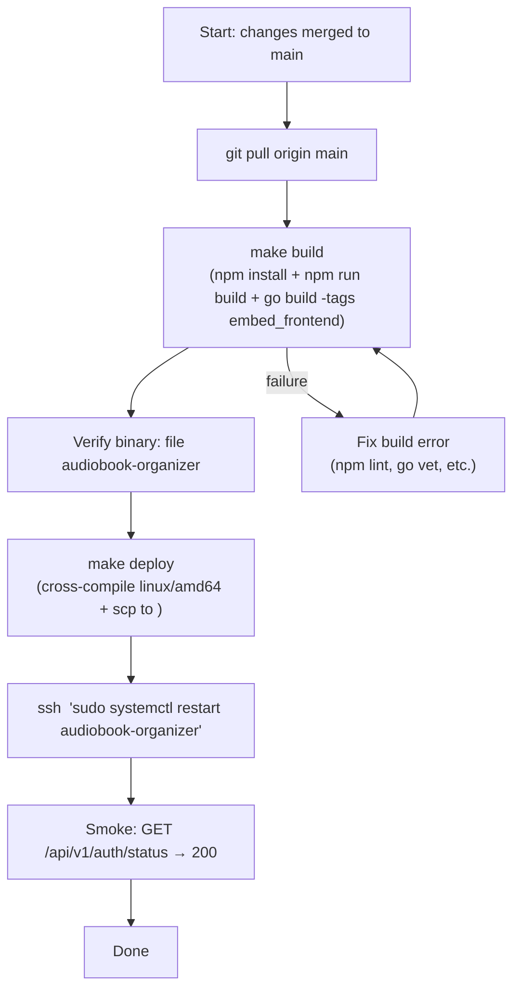

<!-- file: docs/system/runbooks.md -->
<!-- version: 1.1.0 -->
<!-- guid: e5f6a7b8-c9d0-1234-ef01-234567890123 -->
<!-- last-edited: 2026-07-03 -->

# Operator Runbooks

This document collects operational procedures for building, deploying, recovering, and maintaining the Audiobook Organizer in production.

**Production host:** `<server>` (Linux, x86_64/amd64, ZFS raidz2 + NVMe special vdev)

## Deploy Runbook



### Step-by-step

1. Ensure you are on `main` with a clean working tree: `git status`
2. Run the full build: `make build` — this runs `npm install`, `npm run build`, and `go build -tags embed_frontend -o audiobook-organizer`
3. Deploy: `make deploy` — cross-compiles for linux/amd64 and copies to the server. Never substitute manual scp; always run `make deploy` verbatim.
4. Restart the service: `ssh <server> 'sudo systemctl restart audiobook-organizer'`
5. Smoke check: `curl -s https://<server>/api/v1/auth/status` should return `{"data": {...}}`
6. Monitor logs for 60 seconds: `ssh <server> 'journalctl -u audiobook-organizer -f --since now'`

For debug builds (verbose logging): use `make deploy-debug` instead of `make deploy`.

### Systemd service

The service is managed as `audiobook-organizer.service`. Server-specific config (env vars, ExecStart overrides) is in `deploy/local.conf` (gitignored) and deployed as a systemd drop-in at `/etc/systemd/system/audiobook-organizer.service.d/local.conf`.

```bash
# Service control
sudo systemctl status audiobook-organizer
sudo systemctl start audiobook-organizer
sudo systemctl stop audiobook-organizer
sudo systemctl restart audiobook-organizer

# Reload drop-in config
sudo systemctl daemon-reload
sudo systemctl restart audiobook-organizer
```

## Reparse Intro Transcriptions (No GPU Required)

Use when a parser fix has been shipped and you need to re-extract `TranscribedTitle/Author/Narrator` from already-stored transcription text without running Whisper again.

```bash
curl -X POST https://<server>/api/v1/operations/v2 \
  -H "Authorization: Bearer abk_..." \
  -H "Content-Type: application/json" \
  -d '{"def_id":"maintenance.transcribe-book-intros","params":{"reparse_only":true}}'
```

Poll for completion:
```bash
# Get op ID from the POST response, then:
curl -s https://<server>/api/v1/operations/v2/<OP_ID> \
  -H "Authorization: Bearer abk_..."
```

Expected outcome: parser rewrites `TranscribedTitle/Author/Narrator` for all books with an existing `IntroTranscription`. No ffmpeg or GPU required. First prod run corrected ~80% of transcribed books.

## Full Intro Transcription Run (GPU Required)

Only run on the GPU machine (GTX 1050 Ti, sm_61). Requires the Windows GPU machine to be reachable from the server.

```bash
curl -X POST https://<server>/api/v1/operations/v2 \
  -H "Authorization: Bearer abk_..." \
  -H "Content-Type: application/json" \
  -d '{"def_id":"maintenance.transcribe-book-intros","params":{}}'
```

- 200 books per page; 4 parallel ffmpeg workers extract 90s WAV per book
- One Python/Whisper process per page (model loads once, not once per book)
- Checkpoint written after each page; safe to restart server mid-run
- Expected time: ~2–3h on GPU (vs. ~62h without batch mode)

## Dedup Triage and Purge (Dry-Run First)

**CAUTION:** Dedup purge ops are irreversible. Always run the triage op first and review the breakdown before authorizing purge.

```bash
# Step 1: dry-run triage (read-only)
curl -X POST https://<server>/api/v1/operations/v2 \
  -H "Authorization: Bearer abk_..." \
  -d '{"def_id":"maintenance.dedup-exact-triage"}'

# Review: check that the "genuine" count is reasonable and "stub"/"fragment"
# counts match expectations before proceeding.

# Step 2 (only after review): purge confirmed purgeable candidates
# curl -X POST ... -d '{"def_id":"maintenance.dedup-auto-purge"}'
```

Purge skips books with iTunes persistent IDs (PID). Never auto-purge books linked to iTunes.

## Backup and Restore

### Create backup

```bash
curl -X POST https://<server>/api/v1/backup/create \
  -H "Authorization: Bearer abk_..."
```

This uses PebbleDB's built-in checkpoint API (`PebbleStore.Checkpoint`) for a consistent point-in-time snapshot. The backup is written to the configured backup directory on the server.

### Restore

1. Stop the service: `sudo systemctl stop audiobook-organizer`
2. Replace the PebbleDB directory: `cp -a /backup/audiobooks.pebble /var/lib/audiobook-organizer/audiobooks.pebble`
3. Restart: `sudo systemctl start audiobook-organizer`
4. Wait for memdb warmup (~30s on a 50K-book library)

## memdb Warmup Recovery

On server start, all books are loaded from PebbleDB into the in-memory query layer (memdb). For a 50K-book library, this takes approximately 30 seconds. During warmup:

- The API is available but slow (some queries fall back to PebbleDB scans)
- Library list pages may show incorrect counts until warmup completes
- Do not restart the service again during warmup

Check warmup progress in logs:
```bash
journalctl -u audiobook-organizer | grep "memdb"
```

## iTunes Path Heal

If organize moved files and iTunes paths became stale (FilePath records no longer resolve):

```bash
curl -X POST https://<server>/api/v1/operations/v2 \
  -H "Authorization: Bearer abk_..." \
  -d '{"def_id":"maintenance.itunes-heal"}'
```

This op parses the iTunes XML, builds a filename index of the organized library, and heals stale paths using author/album/track-number signals. Idempotent (uses ZFS reflinks). First run healed 2,274 tracks; 0 errors.

## Known CI Noise

These CI issues are pre-existing and not caused by your changes:

| Issue | Root cause | Action |
|---|---|---|
| Mock freshness drift (`mocks-check`) | `mockery` interface{}/any drift between mockery versions | Run `make mocks` to regenerate; commit if `make mocks-check` passes |
| Flaky backup tests | Race between backup goroutine and test teardown | Rerun; if consistently failing, investigate lock ordering |
| Flaky scan tests | Filesystem timing on slow CI runners | Rerun up to 3x before investigating |

## API Key Reference

- API keys are prefixed `abk_`
- Obtain via browser login → Settings → API Keys, or via `POST /api/v1/auth/api-keys`
- Bootstrap key (first-run): `POST /api/v1/auth/bootstrap` → `response.data.api_key`
- Never commit API keys to source control
- Credentials for CI are stored in the repository secrets, not in `.env` files

## Cross-references

- Build commands: [CLAUDE.md](../../CLAUDE.md)
- Pipelines (operation internals): [pipelines.md](pipelines.md)
- Storage (backup locations): [storage.md](storage.md)

## Monitoring & Alerting Runbook

Closes OPS-4/OPS-5: `/metrics` is served unauthenticated (LAN-only, accepted
risk per pen-test finding MED-1 — see the comment in
`internal/server/server_lifecycle.go`), but nothing scrapes it and there is
no alerting layer. OpenAI quota exhaustion, the 69GB cache-warmup memory
bloat, and op wedges were all discovered by a human noticing symptoms, not
an alert. This section wires up a minimal, self-hostable
Prometheus + Alertmanager setup using the config shipped in
`deploy/prometheus/`.

**Prerequisite:** a Prometheus + Alertmanager install, either on the
production host itself or on a separate host that can reach it over the
network. This repo does not install or manage Prometheus/Alertmanager —
it only ships the scrape config and alert rules to plug into an existing
install. No SaaS/hosted monitoring product (PagerDuty, Opsgenie, Datadog,
etc.) is required or assumed.

### Merge the scrape config

1. Copy the job from
   [`deploy/prometheus/scrape-config.yml`](../../deploy/prometheus/scrape-config.yml)
   into your Prometheus's `prometheus.yml` under `scrape_configs:`. Replace
   the placeholder target (`192.168.0.10:8484`) with your actual
   audiobook-organizer host and port (default port `8484`, per
   `deploy/audiobook-organizer.service` / `deploy/local.conf.example`).
2. Reload Prometheus without restarting it:
   ```bash
   curl -X POST http://localhost:9090/-/reload
   # or, if Prometheus is managed by systemd:
   systemctl reload prometheus
   ```
3. Verify the target is up: Prometheus UI → Status → Targets → confirm
   `audiobook-organizer` shows `UP`.

### Load the alert rules

1. Copy [`deploy/prometheus/alert-rules.yml`](../../deploy/prometheus/alert-rules.yml)
   into your Prometheus's rule-file directory (or reference it directly via
   a `rule_files:` entry in `prometheus.yml`), then reload Prometheus as
   above.
2. Wire up Alertmanager with at least one receiver so the rules actually
   notify someone — a minimal self-hosted option is an email receiver or a
   webhook to something you already run (e.g. a self-hosted ntfy/ Gotify
   instance). No SaaS incident-management product is required; only add one
   if you already operate one.
3. Verify rules loaded: Prometheus UI → Status → Rules → confirm the
   `audiobook-organizer` group's five alerts (`AudiobookOrganizerOpFailuresHigh`,
   `AudiobookOrganizerBackendUnavailable`, `AudiobookOrganizerMemoryHigh`,
   `AudiobookOrganizerDown`, `AudiobookOrganizerDiskLow`) appear with no
   parse errors.

### Disk-space alert prerequisite

`AudiobookOrganizerDiskLow` depends on `node_filesystem_avail_bytes` /
`node_filesystem_size_bytes`, which are exported by `node_exporter` — this
is **not** installed by this task and must be set up separately (e.g.
`apt install prometheus-node-exporter` on Debian/Ubuntu, or the equivalent
for your distro), plus a matching scrape job added to `prometheus.yml`.
Without `node_exporter` scraped, this alert simply never fires (no data) —
it does not silently assume disk space is fine.
