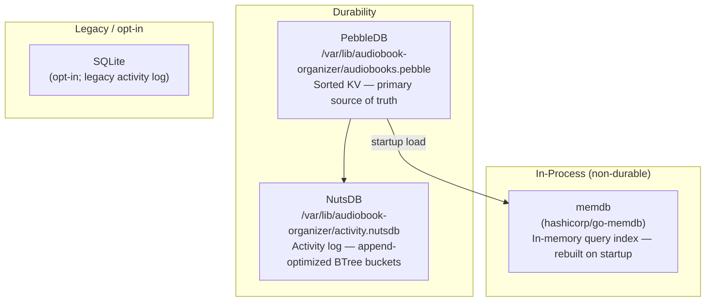
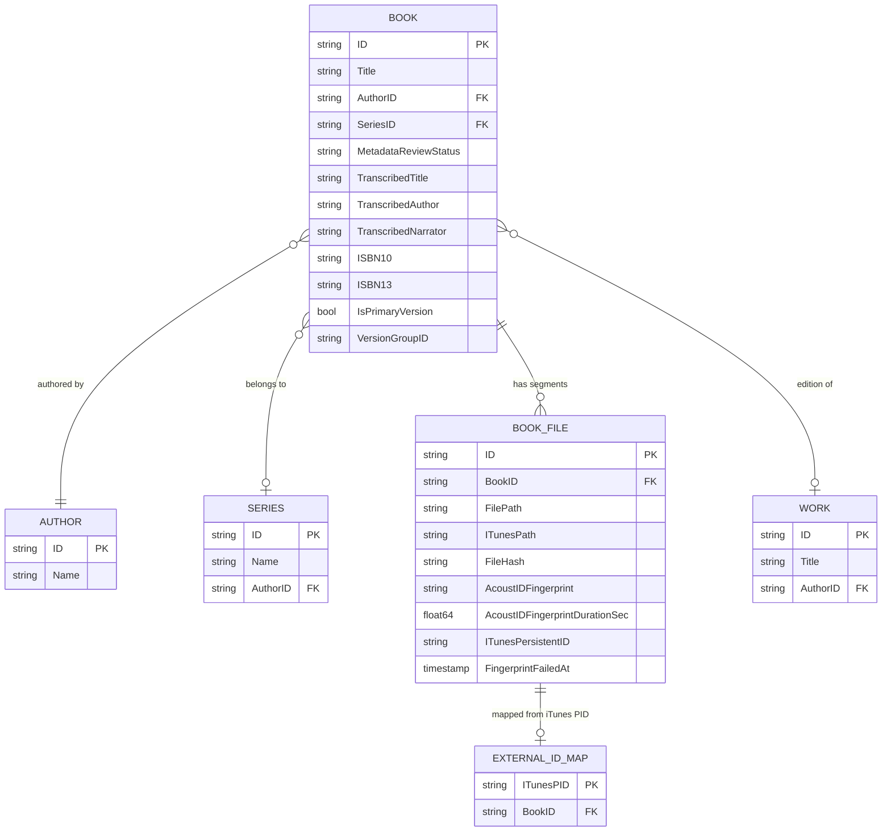

<!-- file: docs/system/storage.md -->
<!-- version: 1.0.0 -->
<!-- guid: c3d4e5f6-a7b8-9012-cdef-012345678901 -->
<!-- last-edited: 2026-06-29 -->

# Storage Architecture

Audiobook Organizer uses three complementary storage tiers: PebbleDB (durable primary KV store), memdb (in-process in-memory query layer populated at startup), and NutsDB (append-optimized activity log). An optional SQLite tier exists for legacy/opt-in use.

## Storage Tiers at a Glance

## PebbleDB Key Conventions

PebbleDB is a sorted key–value store. All keys use colon-delimited prefixes for prefix-scan efficiency. Values are JSON with a `version` field for forward compatibility. IDs are ULIDs (26-char Crockford base32, time-sortable).

### Primary Entity Prefixes

| Prefix | Entity | Notes |
|---|---|---|
| `meta:` | Global metadata and counters | Config blobs, startup flags |
| `mig:` | Migration records | Applied migration IDs |
| `u:` | Users | `u:<userULID>` |
| `ua:` | User auth secrets/hashes | argon2id password hashes |
| `sess:` | Sessions | Short-lived session tokens |
| `pref:` | User preferences | Per-user config |
| `authz:` | Role/permission maps | |
| `a:` | Authors | `a:<authorULID>` |
| `s:` | Series | `s:<seriesULID>` |
| `w:` | Works | Logical title grouping across editions |
| `b:` | Books | `b:<bookULID>` — primary audiobook entity |
| `bf:` | Book file segments | Physical media files |
| `bfi:` | Book→segment ordering index | |
| `pl:` | Playlists | |
| `pli:` | Playlist items | Ordered |
| `playe:` | Playback events | Append-only log |
| `playp:` | Playback progress | Latest snapshot per book |
| `stats:` | Derived aggregates | e.g. `stats:library` |
| `op:` | Operations (legacy v1) | |
| `opl:` | Operation logs | |
| `opv2:` | Operations v2 | `opv2:<opID>` — full state |
| `opv2:act:` | Active operation set | `opv2:act:<opID>` → `""` (queued/running) |

### Secondary Index Prefixes

| Prefix pattern | Resolves to |
|---|---|
| `idx:user:username:<lower>` | `<userULID>` |
| `idx:user:email:<lower>` | `<userULID>` |
| `idx:author:name:<normalized>` | `<authorULID>` |
| `idx:series:name:<normalized>` | `<seriesULID>` |
| `idx:series:author:<authorULID>:<seriesULID>` | `1` |
| `idx:book:author:<authorULID>:<bookULID>` | `1` |
| `idx:book:series:<seriesULID>:<posPadded>:<bookULID>` | `1` |
| `idx:book:title:<normalized>:<bookULID>` | `1` |
| `idx:book:tag:<tagLower>:<bookULID>` | `1` |
| `idx:book:isbn10:<isbn10norm>:<bookULID>` | `1` |
| `idx:book:isbn13:<isbn13norm>:<bookULID>` | `1` |
| `idx:work:title:<normalizedTitle>:author:<authorULID>` | `<workULID>` |
| `idx:book:work:<workULID>:<bookULID>` | `1` |
| `external_id_map` prefix | iTunes PID → bookULID mapping (migration 34) |

### Cached Aggregate Pattern

The library count aggregate (`stats:library`) uses a lazy dirty-flag pattern to avoid expensive full-library scans on every request:

1. On write operations (`UpdateBook`, `DeleteBook`, etc.), `InvalidateLibraryStats` deletes the `stats:library` key (marks dirty)
2. On read, if the key is missing (dirty) AND the min-recompute interval has elapsed (default 10 min, env `LIBRARY_COUNTS_CACHE_MIN_INTERVAL_SECONDS`), the store recomputes and writes the aggregate
3. A `libraryCountsRecomputeMu` mutex prevents stampede when N callers simultaneously see a dirty cache

## memdb In-Memory Query Layer

At startup, PebbleDB data is loaded into `hashicorp/go-memdb` for O(1) index lookups without PebbleDB's scan overhead. The memdb schema (`internal/database/memdb_schema.go`) defines tables and indexes:

### Tables

| Table constant | Description |
|---|---|
| `books` | All books with their metadata |
| `authors` | Author records |
| `series` | Series records |
| `book_files` | Physical file segments |
| `narrators` | Narrator records |
| `book_authors` | Book↔author join |
| `book_narrators` | Book↔narrator join |
| `import_paths` | Configured import directory paths |
| `author_aliases` | Author name alias mappings |
| `blocked_hashes` | File hashes blocked from import |

### Key Indexes

| Index | Table | Accelerates |
|---|---|---|
| `id` | all | Primary key lookup |
| `title` | books | Title-based filtering and sort |
| `author_id` | books | Author→books list |
| `series_id` | books | Series→books list |
| `book_id` | book_files | Book→segments |
| `narrator_id` | book_narrators | Narrator→books |
| `file_path` | book_files | Path dedup, file existence checks |
| `file_hash` | book_files | Hash-based dedup |
| `is_primary_version` | books | Primary-version filter |
| `marked_for_deletion` | books | Soft-delete filtering |
| `version_group_id` | books | Version group membership |
| `itunes_persistent_id` | book_files | iTunes PID lookup |
| `missing` | book_files | Missing-file report |
| `path` | books | Library path dedup |
| `enabled` | import_paths | Active import path list |
| `alias_name` | author_aliases | Alias resolution |
| `hash` | blocked_hashes | Blocked file detection |
| `deluge_hash` | book_files | Deluge torrent hash |

**Critical gotcha:** memdb strips `AcoustIDFingerprint` (large blob field) from `BookFile` rows. Use `AcoustIDFingerprintDurationSec > 0` as the memdb-safe proxy for "has fingerprint". See `stripBookFileForMemdb`.

**Critical gotcha:** `GetAllBooksFrom` with the memdb path has cursor pagination that was silently capped at 2×limit (~400 books) before PR #1647. Use `ListBookIDs + RunItems` for full-library jobs; verify mid-library not just head/tail.

## NutsDB Activity Log

NutsDB stores the activity log in BTree buckets. The bucket naming convention:

| Bucket pattern | Key format | Value |
|---|---|---|
| `act:<tier>` | `<20-digit-unix-nano>:<ulid>` | JSON `ActivityEntry` |
| `act:op:<op_id>` | `<timekey>` | `<tier>:<timekey>` (op index) |
| `act:bk:<book_id>` | `<timekey>` | `<tier>:<timekey>` (book index) |

Tiers map to activity types (scan, organize, metadata_apply, tag_write, etc.). Daily digest compaction is performed by `CompactByDay` (also called via `POST /api/v1/admin/recompact-digests`).

A dual-write adapter (`dual_write_activity_store.go`) bridges the legacy SQLite activity log during migration.

## SQLite (opt-in legacy)

SQLite is available for the legacy activity log. New deployments use NutsDB exclusively. The SQLite path is disabled by default and exists for backward compatibility with pre-NutsDB deployments.

## Filesystem Assets

Beyond the database, these filesystem paths are relevant:

| Path | Contents |
|---|---|
| `/var/lib/audiobook-organizer/audiobooks.pebble` | PebbleDB data directory |
| `/var/lib/audiobook-organizer/activity.nutsdb` | NutsDB activity log |
| `/mnt/bigdata/books/audiobook-organizer/` | Organized audiobook library root |
| `/mnt/bigdata/books/itunes/iTunes Library.xml` | iTunes XML (88K tracks / 11.7K albums) |
| `covers/history/` | Archived cover art (SHA-256 dedup) |
| `covers/dedup/{hash}.{ext}` | Identical covers stored once |

## Entity Relationship Overview

## Cross-references

- Architecture: [architecture.md](architecture.md)
- API for querying storage: [api.md](api.md)
